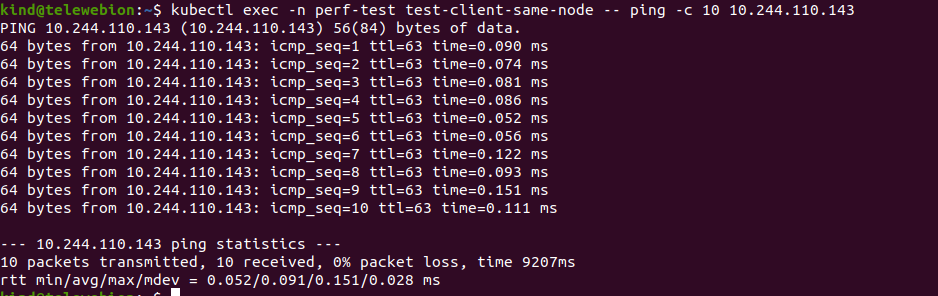
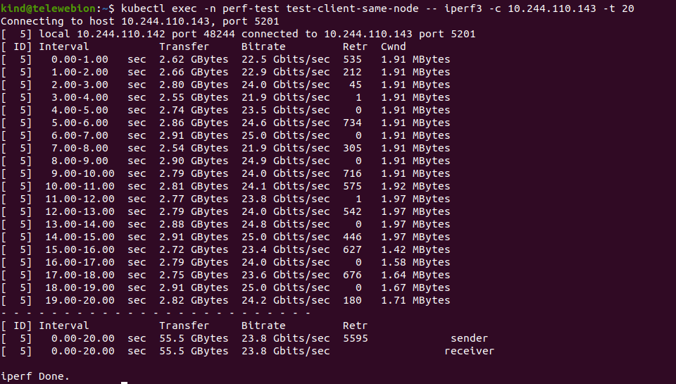
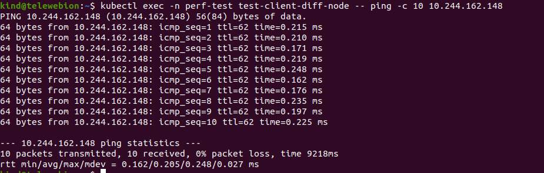
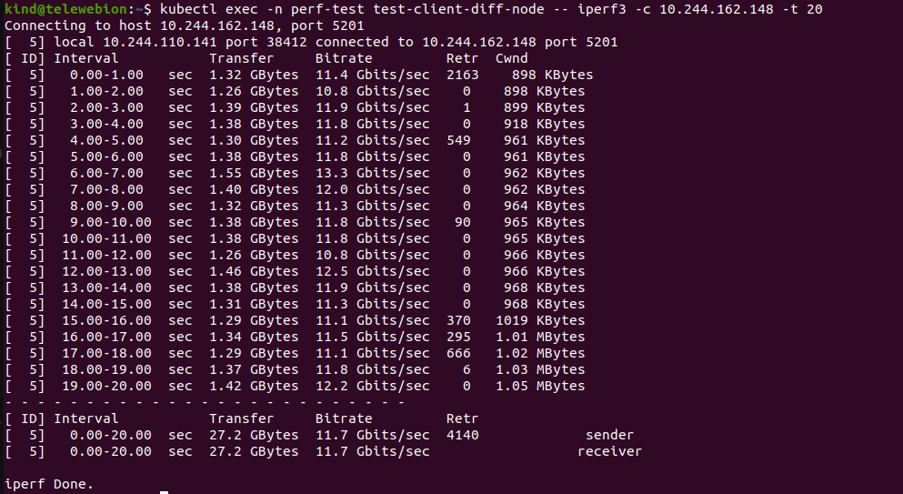
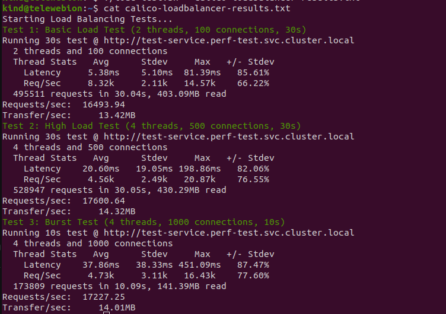

# 🔬 Comparing Cilium and Calico as Kubernetes CNI Plugins

## 📌 Objective

This document provides a technical comparison of **Cilium** and **Calico** as Container Network Interface (CNI) plugins in a Kubernetes cluster.  
We measure and compare their **network latency**, **throughput**, and **load balancing performance** using standard tools and test cases.

---

## 📋 Requirements

### System Requirements
- Linux system (Ubuntu 20.04+ recommended)
- 8 GB RAM minimum
- 2+ vCPUs
- Docker installed
- `kubectl` installed
- Internet access to download container images

### Tools Used
- [kind](https://kind.sigs.k8s.io/) (Kubernetes in Docker)
- [iperf3](https://iperf.fr/) (network throughput testing)
- `ping` (latency testing)
- `wrk` or `hey` (HTTP load testing)
- `cilium` CLI
- `calico` manifests

---

## 🚀 Step-by-Step Setup

### ✅ Step 1: Create Kind Cluster
```bash
cat <<EOF > kind-config.yaml
kind: Cluster
apiVersion: kind.x-k8s.io/v1alpha4
nodes:
  - role: control-plane
  - role: worker
  - role: worker
networking:
  disableDefaultCNI: true
EOF
```

```bash 
kind create cluster --config kind-config.yaml 
```

✅ Step 2: Deploy Calico CNI

```bash
kubectl apply -f https://raw.githubusercontent.com/projectcalico/calico/v3.27.0/manifests/calico.yaml
```

Wait until pods are Running:
```bash
kubectl get pods -n kube-system
```

✅ Step 3: First test: Pod-to-Pod communication

```bash
cat <<EOF > pod-to-pod-test.yaml
apiVersion: v1
kind: Namespace
metadata:
  name: perf-test
---
# Pod 1 - Server
apiVersion: v1
kind: Pod
metadata:
  name: test-server-same-node
  namespace: perf-test
  labels:
    app: perf-test
    test-group: group1
spec:
  containers:
  - name: iperf3-server
    image: docker.arvancloud.ir/networkstatic/iperf3
    command: ["iperf3", "-s"]
---
# Pod 2 - Client (Same Node)
apiVersion: v1
kind: Pod
metadata:
  name: test-client-same-node
  namespace: perf-test
  labels:
    app: perf-test
    test-group: group1
spec:
  containers:
  - name: iperf3-client
    image: docker.arvancloud.ir/networkstatic/iperf3
    command: ["sleep", "infinity"]
  affinity:
    podAffinity:
      requiredDuringSchedulingIgnoredDuringExecution:
      - labelSelector:
          matchLabels:
            test-group: group1
        topologyKey: "kubernetes.io/hostname"
---
# Pod 3 - Server (Different Node)
apiVersion: v1
kind: Pod
metadata:
  name: test-server-diff-node
  namespace: perf-test
  labels:
    app: perf-test
    test-group: group2
spec:
  containers:
  - name: iperf3-server
    image: docker.arvancloud.ir/networkstatic/iperf3
    command: ["iperf3", "-s"]
---
# Pod 4 - Client (Different Node)
apiVersion: v1
kind: Pod
metadata:
  name: test-client-diff-node
  namespace: perf-test
  labels:
    app: perf-test
    test-group: group2
spec:
  containers:
  - name: iperf3-client
    image: docker.arvancloud.ir/networkstatic/iperf3
    command: ["sleep", "infinity"]
  affinity:
    podAntiAffinity:
      requiredDuringSchedulingIgnoredDuringExecution:
      - labelSelector:
          matchLabels:
            test-group: group2
        topologyKey: "kubernetes.io/hostname"
EOF
```
✅ Step 4: Install ping on all pods
```bash
kubectl exec -n perf-test <test-client-diff-node> -- /bin/sh -c "su root -c 'apt-get update && apt-get install -y iputils-ping'"
```

✅ Step 5: Testing pods on the same node

Latency testing:

```bash
kubectl exec -n perf-test test-client-same-node -- ping -c 10 <test-server-same-node or IP>
```
result :



Throughput testing:
```bash
kubectl exec -n perf-test test-client-same-node -- iperf3 -c <test-server-same-node or IP> -t 20
```
result :


✅ Step 6: Different Node Tests

Latency testing:

```bash
kubectl exec -n perf-test test-client-diff-node -- ping -c 10 <test-server-diff-node or IP>
```
result:



Throughput testing:
```bash
kubectl exec -n perf-test test-client-diff-node -- iperf3 -c <test-server-diff-node or IP> -t 20
```
result:



✅ Step 7 : Load Balancing Performance (calico)

```bash
cat <<EOF > load-tester.yaml
apiVersion: apps/v1
kind: Deployment
metadata:
  name: test-app
  namespace: perf-test
spec:
  replicas: 5
  selector:
    matchLabels:
      app: test-app
  template:
    metadata:
      labels:
        app: test-app
    spec:
      containers:
      - name: nginx
        image: nginx
        ports:
        - containerPort: 80
        resources:
          requests:
            cpu: "200m"
            memory: "256Mi"
          limits:
            cpu: "500m"
            memory: "512Mi"
        readinessProbe:
          httpGet:
            path: /
            port: 80
          initialDelaySeconds: 5
          periodSeconds: 5
---
apiVersion: v1
kind: Service
metadata:
  name: test-service
  namespace: perf-test
spec:
  type: ClusterIP
  selector:
    app: test-app
  ports:
  - port: 80
    targetPort: 80
---
apiVersion: v1
kind: Pod
metadata:
  name: load-tester
  namespace: perf-test
spec:
  containers:
  - name: wrk
    image: alpine:3.18
    command:
      - /bin/sh
      - -c
      - |
        apk add --no-cache wrk curl && tail -f /dev/null
EOF
```
Implement deployment and service testing :

```bash
kubectl apply -f load-tester.yaml
```

## bash script for test loadbalancer (calico)

```bash
#!/bin/bash
# save as load-test.sh

GREEN='\033[0;32m'
NC='\033[0m'

echo "Starting Load Balancing Tests..."


echo -e "${GREEN}Test 1: Basic Load Test (2 threads, 100 connections, 30s)${NC}"
kubectl exec -it -n perf-test load-tester -- wrk -t2 -c100 -d30s http://test-service.perf-test.svc.cluster.local

sleep 10

echo -e "${GREEN}Test 2: High Load Test (4 threads, 500 connections, 30s)${NC}"
kubectl exec -it -n perf-test load-tester -- wrk -t4 -c500 -d30s http://test-service.perf-test.svc.cluster.local

sleep 10


echo -e "${GREEN}Test 3: Burst Test (4 threads, 1000 connections, 10s)${NC}"
kubectl exec -it -n perf-test load-tester -- wrk -t4 -c1000 -d10s http://test-service.perf-test.svc.cluster.local
```
result : 



✅ Step 8 : 
