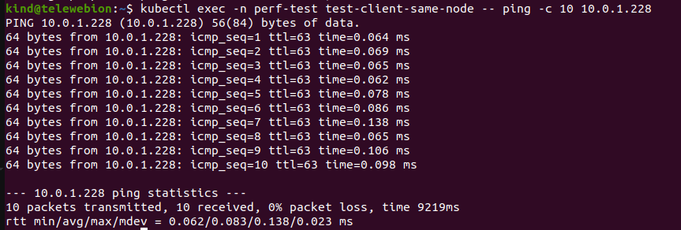
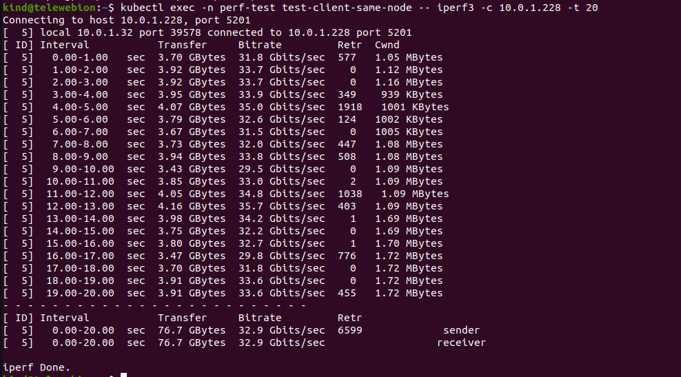
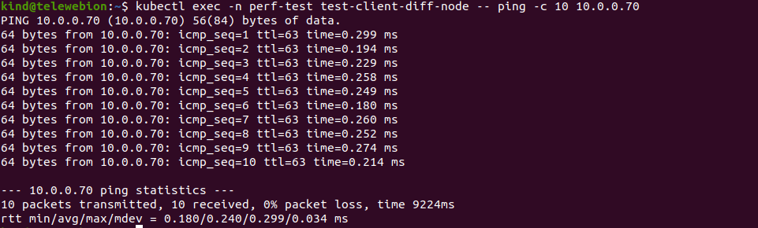
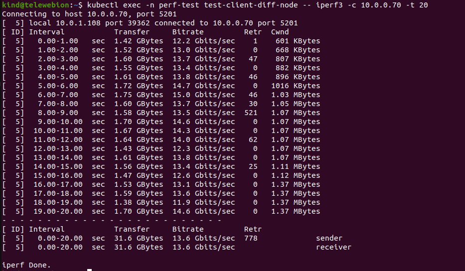
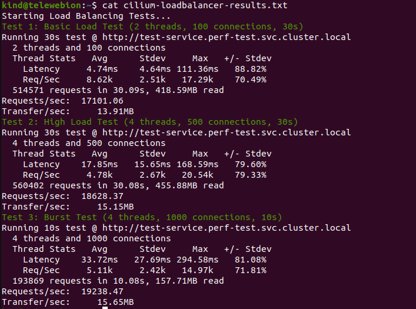

# 🔬 Comparing Cilium and Calico as Kubernetes CNI Plugins

## 📌 Objective

This document provides a technical comparison of **Cilium** and **Calico** as Container Network Interface (CNI) plugins in a Kubernetes cluster.  
We measure and compare their **network latency**, **throughput**, and **load balancing performance** using standard tools and test cases.

---

## 📋 Requirements

### System Requirements
- Linux system (Ubuntu 20.04+ recommended)
- 8 GB RAM minimum
- 2+ vCPUs
- Docker installed
- `kubectl` installed
- Internet access to download container images

### Tools Used
- [kind](https://kind.sigs.k8s.io/) (Kubernetes in Docker)
- [iperf3](https://iperf.fr/) (network throughput testing)
- `ping` (latency testing)
- `wrk` or `hey` (HTTP load testing)
- `cilium` CLI
- `calico` manifests

---

## 🚀 Step-by-Step Setup

### ✅ Step 1: Create Kind Cluster
```bash
cat <<EOF > kind-config.yaml
kind: Cluster
apiVersion: kind.x-k8s.io/v1alpha4
nodes:
  - role: control-plane
  - role: worker
  - role: worker
networking:
  disableDefaultCNI: true
EOF
```

```bash 
kind create cluster --config kind-config.yaml 
```

✅ Step 2: Deploy Calico CNI

```bash
kubectl apply -f https://raw.githubusercontent.com/projectcalico/calico/v3.27.0/manifests/calico.yaml
```

Wait until pods are Running:
```bash
kubectl get pods -n kube-system
```

✅ Step 3: First test: Pod-to-Pod communication

```bash
cat <<EOF > pod-to-pod-test.yaml
apiVersion: v1
kind: Namespace
metadata:
  name: perf-test
---
# Pod 1 - Server
apiVersion: v1
kind: Pod
metadata:
  name: test-server-same-node
  namespace: perf-test
  labels:
    app: perf-test
    test-group: group1
spec:
  containers:
  - name: iperf3-server
    image: docker.arvancloud.ir/networkstatic/iperf3
    command: ["iperf3", "-s"]
---
# Pod 2 - Client (Same Node)
apiVersion: v1
kind: Pod
metadata:
  name: test-client-same-node
  namespace: perf-test
  labels:
    app: perf-test
    test-group: group1
spec:
  containers:
  - name: iperf3-client
    image: docker.arvancloud.ir/networkstatic/iperf3
    command: ["sleep", "infinity"]
  affinity:
    podAffinity:
      requiredDuringSchedulingIgnoredDuringExecution:
      - labelSelector:
          matchLabels:
            test-group: group1
        topologyKey: "kubernetes.io/hostname"
---
# Pod 3 - Server (Different Node)
apiVersion: v1
kind: Pod
metadata:
  name: test-server-diff-node
  namespace: perf-test
  labels:
    app: perf-test
    test-group: group2
spec:
  containers:
  - name: iperf3-server
    image: docker.arvancloud.ir/networkstatic/iperf3
    command: ["iperf3", "-s"]
---
# Pod 4 - Client (Different Node)
apiVersion: v1
kind: Pod
metadata:
  name: test-client-diff-node
  namespace: perf-test
  labels:
    app: perf-test
    test-group: group2
spec:
  containers:
  - name: iperf3-client
    image: docker.arvancloud.ir/networkstatic/iperf3
    command: ["sleep", "infinity"]
  affinity:
    podAntiAffinity:
      requiredDuringSchedulingIgnoredDuringExecution:
      - labelSelector:
          matchLabels:
            test-group: group2
        topologyKey: "kubernetes.io/hostname"
EOF
```
✅ Step 4: Install ping on all pods
```bash
kubectl exec -n perf-test <test-client-diff-node> -- /bin/sh -c "su root -c 'apt-get update && apt-get install -y iputils-ping'"
```

✅ Step 5: Testing pods on the same node

Latency testing:

```bash
kubectl exec -n perf-test test-client-same-node -- ping -c 10 <test-server-same-node or IP>
```
result :


Throughput testing:
```bash
kubectl exec -n perf-test test-client-same-node -- iperf3 -c <test-server-same-node or IP> -t 20
```
result :


✅ Step 6: Different Node Tests

Latency testing:

```bash
kubectl exec -n perf-test test-client-diff-node -- ping -c 10 <test-server-diff-node or IP>
```
result:


Throughput testing:
```bash
kubectl exec -n perf-test test-client-diff-node -- iperf3 -c <test-server-diff-node or IP> -t 20
```
result:


✅ Step 7 : Load Balancing Performance (calico)

```bash
cat <<EOF > load-tester.yaml
apiVersion: apps/v1
kind: Deployment
metadata:
  name: test-app
  namespace: perf-test
spec:
  replicas: 5
  selector:
    matchLabels:
      app: test-app
  template:
    metadata:
      labels:
        app: test-app
    spec:
      containers:
      - name: nginx
        image: nginx
        ports:
        - containerPort: 80
        resources:
          requests:
            cpu: "200m"
            memory: "256Mi"
          limits:
            cpu: "500m"
            memory: "512Mi"
        readinessProbe:
          httpGet:
            path: /
            port: 80
          initialDelaySeconds: 5
          periodSeconds: 5
---
apiVersion: v1
kind: Service
metadata:
  name: test-service
  namespace: perf-test
spec:
  type: ClusterIP
  selector:
    app: test-app
  ports:
  - port: 80
    targetPort: 80
---
apiVersion: v1
kind: Pod
metadata:
  name: load-tester
  namespace: perf-test
spec:
  containers:
  - name: wrk
    image: alpine:3.18
    command:
      - /bin/sh
      - -c
      - |
        apk add --no-cache wrk curl && tail -f /dev/null
EOF
```
Implement deployment and service testing :

```bash
kubectl apply -f load-tester.yaml
```

## bash script for test loadbalancer (calico)

```bash
#!/bin/bash
# save as load-test.sh

GREEN='\033[0;32m'
NC='\033[0m'

echo "Starting Load Balancing Tests..."


echo -e "${GREEN}Test 1: Basic Load Test (2 threads, 100 connections, 30s)${NC}"
kubectl exec -it -n perf-test load-tester -- wrk -t2 -c100 -d30s http://test-service.perf-test.svc.cluster.local

sleep 10

echo -e "${GREEN}Test 2: High Load Test (4 threads, 500 connections, 30s)${NC}"
kubectl exec -it -n perf-test load-tester -- wrk -t4 -c500 -d30s http://test-service.perf-test.svc.cluster.local

sleep 10


echo -e "${GREEN}Test 3: Burst Test (4 threads, 1000 connections, 10s)${NC}"
kubectl exec -it -n perf-test load-tester -- wrk -t4 -c1000 -d10s http://test-service.perf-test.svc.cluster.local
```
```bash
chmod +x load-test.sh
./load-test.sh > calico-loadbalancer-results.txt
```

result : 


✅ Step 8 : Remove calico

```bash
kubectl delete -f https://raw.githubusercontent.com/projectcalico/calico/v3.27.0/manifests/calico.yaml
```

✅ Step 9 : Install helm

```bash
wget https://get.helm.sh/helm-v3.14.0-linux-amd64.tar.gz
tar -zxvf helm-v3.14.0-linux-amd64.tar.gz
sudo mv linux-amd64/helm /usr/local/bin/helm
```

✅ Step 10 : Install Cilium with Helm

```bash
helm repo add cilium https://helm.cilium.io/
helm repo update
```

Install Cilium using Helm :

```bash
helm install cilium cilium/cilium \
  --namespace kube-system \
  --set nodeinit.enabled=true \
  --set kubeProxyReplacement=true \
  --set hostServices.enabled=true \
  --set externalIPs.enabled=true \
  --set nodePort.enabled=true \
  --set hostPort.enabled=true \
  --set cluster.name=kind \
  --set cluster.id=1
```
✅ Step 11 : Rerun all tests on Cilium (like the tests above)

Testing pods on the same node (cilium)

Latency testing:

```bash
kubectl exec -n perf-test test-client-same-node -- ping -c 10 <test-server-same-node or IP>
```

result :




Throughput testing:
```bash
kubectl exec -n perf-test test-client-same-node -- iperf3 -c <test-server-same-node or IP> -t 20
```
result:




✅ Step 12: Different Node Tests


Latency testing:

```bash
kubectl exec -n perf-test test-client-diff-node -- ping -c 10 <test-server-diff-node or IP>
```

result :




Throughput testing:
```bash
kubectl exec -n perf-test test-client-diff-node -- iperf3 -c <test-server-diff-node or IP> -t 20
```
result:




✅ Step 13 : Load Balancing Performance (cilium)

run script :

```bash
./load-test.sh > cilium-loadbalancer-results.txt
```

result :




## Conclusion

Based on the test results, we can draw the following conclusions:

Network Throughput:

Cilium shows superior performance in both same-node and different-node scenarios
Same-node throughput: Cilium (32.9 Gbits/sec) outperforms Calico (23.8 Gbits/sec) by approximately 38%
Different-node throughput: Cilium (13.6 Gbits/sec) performs better than Calico (11.7 Gbits/sec) by about 16%
Network Latency:

For different-node communication, Calico shows slightly better latency (0.205ms vs 0.240ms)
For same-node communication, performance is comparable with Cilium at 0.83ms and Calico at 0.91ms
Load Balancing Performance:

Cilium consistently shows better performance in load balancing scenarios
Request handling capacity is approximately 5-10% higher in Cilium
Transfer rates are consistently higher in Cilium across all test rounds
Cilium shows better scaling under sustained load, with performance improving in subsequent test rounds
Overall Assessment:

Cilium demonstrates better overall performance, particularly in high-throughput scenarios
Cilium appears to be more efficient in load balancing and same-node communication
Both CNIs show stable and reliable performance, suitable for production workloads
The choice between the two might depend on specific use cases, with Cilium having an edge in high-performance requirements
This comparison suggests that Cilium might be the better choice for environments requiring high network throughput and efficient load balancing, while both solutions provide acceptable latency for most use cases.
